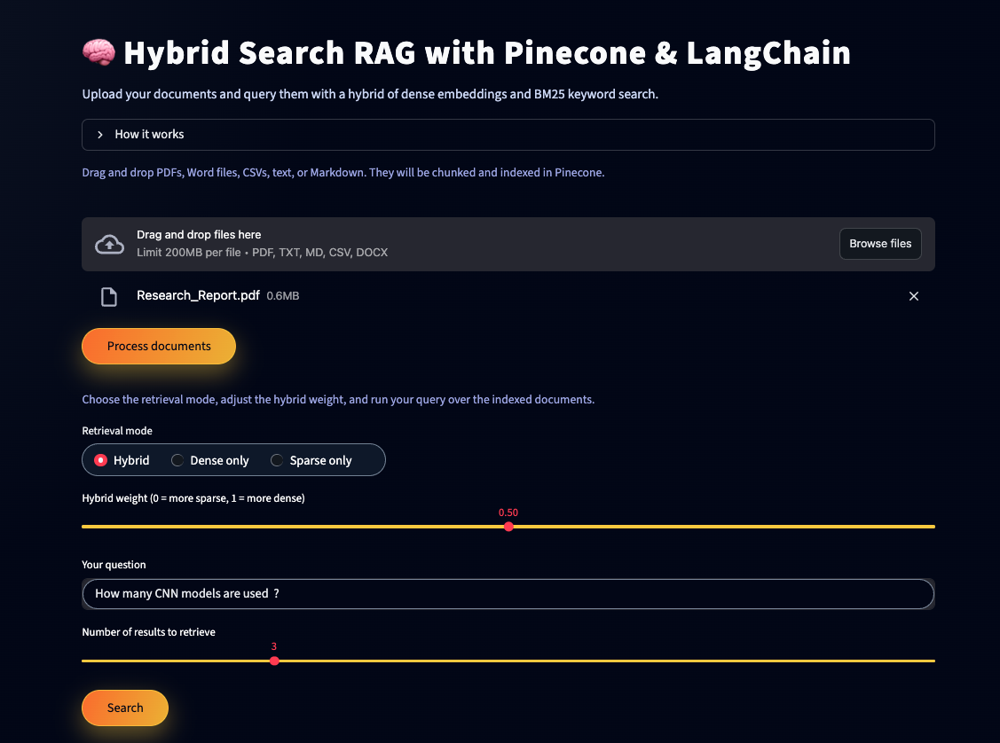
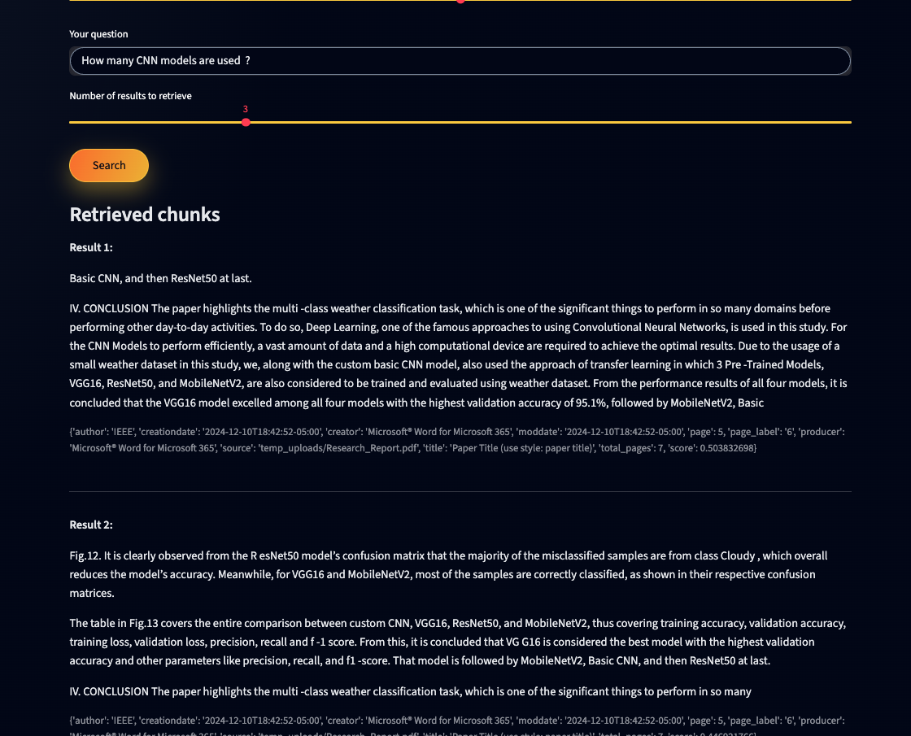

# 🧠 Hybrid-Docs-RAG (Pinecone + BM25 + Embeddings)

Interact with your own documents using **hybrid search** that combines:

- Dense semantic embeddings (MiniLM via HuggingFace)
- Sparse keyword signals (BM25)
- Vector storage and retrieval with **Pinecone**
- A clean **Streamlit** UI

Upload PDFs, Word files, CSVs, or text and ask natural-language questions over them.

---


## 🖼️ Application Preview

#### Home Screen
 

#### Summary Output
 


---

## Features

- 📂 Upload multiple files: **PDF, DOCX, CSV, TXT, MD**
- 🧩 Automatic document chunking with a character-based splitter
- 🔎 Hybrid retrieval using **dense + BM25** in Pinecone
- 🎚 Control over retrieval:
  - Mode: **Hybrid**, **Dense only**, or **Sparse only**
  - Slider to adjust hybrid weight between sparse and dense signals
- 🖥 Simple Streamlit interface with an explanation of how hybrid search works

---

## Project Setup

### 1. Clone the repo

```bash
git clone https://github.com/<your-username>/hybrid-docs-rag.git
cd hybrid-docs-rag
```

---

## How it works

- You upload one or more documents (PDF, DOCX, CSV, TXT, MD).
- The app reads and splits them into overlapping text chunks.
- Each chunk gets:
  - a dense embedding from all-MiniLM-L6-v2,
  - a sparse BM25 vector based on its terms.
- All vectors are stored in a Pinecone index.
- At query time, the app:
  - builds a dense embedding and sparse vector for the query,
  - runs hybrid retrieval in Pinecone,
  - returns the top-k most relevant chunks.
- You can choose:
  - Hybrid mode (mix of sparse + dense),
  - Dense only (embeddings focus),
  - Sparse only (keyword focus),
- Adjust the hybrid weight to see how results change.


---

## Tech stack

- Frontend / UX: Streamlit
- Vector DB: Pinecone
- Retrieval: PineconeHybridSearchRetriever (LangChain)
- Embeddings: HuggingFace all-MiniLM-L6-v2
- Sparse encoder: BM25Encoder (pinecone-text)
- Language tools: LangChain


